# online-store-microservice-architecture
Выпускной проект по курсу **OTUS Java Developer Advanced**

### Технологии и инструменты:
* JDK 21
* Spring Boot 3.5+,
* Spring Cloud API Gateway
* Spring Cloud Eureka
* Kafka,
* Postgres,
* MiniIO,
* GRPC,
* Spring WebFlux,
* Docker,
* Docker compose
* Liquibase,
* Prometheus,
* Grafana,
* JMH

### Сервисы:
* order-service - сервис по управлению заказами (Создание, отмена, список)
* payment-service - mock платежный сервис для заказов
* dictionaries-service - сервис по управлению справочными данными (Список продуктов)
* images-service - сервис по управлению изображениями (Для продуктов)
* api-gateway - Gateway
* service-registry - Реестр сервисов

### Сборка и запуск

Выполнить в корне проекта:

  ```bash
      docker-compose up -d
   ```

Накатить liquibase миграции через

  ```bash
      gradle update
   ```

### Карта реализованных пунктов ТЗ

1) Урок 1. Java 11 vs 17 vs 21.

   Во всех сервисах используется Open JDK 21.

2) Урок 15. Java.util.concurrent. Atomics, ConcurrentHashMap, ConcurrentSkipListMap.

   ConcurrentHashMap используется в сервисе dictionaries-service классе ProductCacheImpl и др.

3) Урок 33. Swagger.

   В сервисе image-service добавлен SWAGGER.
   URL: http://localhost:8084/swagger-ui/index.html

4) Урок 34. Protobuf and GRPC.
   
   В сервисе dictionaries-service реализован GRPC сервер, а в сервисе order-service GRPC клиент.

5) Урок 4. Memory management. JVM memory structure.
   
   В сервисе image-service использован SoftReference.
   Класс ru.amironnikov.image.service.impl.ImageSoftReferenceServiceImpl.

6 и 7) Урок 7. Memory Dump и Урок 14. Разбор JMeter и организация нагрузочного тестирования.

   Подадим нагрузку на сервис изображений с помощью JMeter
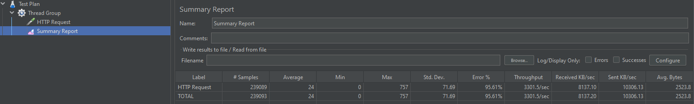
   Подождём пару минут и соберем дамп памяти командой 
   ```bash
      jmap -dump:format=b,file=heapdump.hprof,live <pid>
   ```
   Загрузим дамп в Eclipse Memory Analyzer:

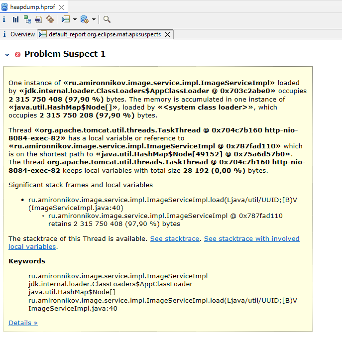

   В отчёте видно, что больше всего памяти потребляет HashMap в классе ImageServiceImpl.
   Как и ожидалось, т.к. там находится кэш изображений:

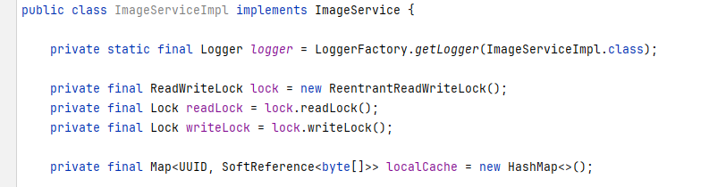

8)    Пункт ТЗ. Для миграций использовался Liquibase. Сервисы order-service и dictionaries-service.

9)    Пункт ТЗ. Каждое приложение работает со своей схемой данных, в которых есть справочники.

10)   Урок 8. "Off-heap".

      В сервисе image-service используется off-heap cache.
      В классе ru.amironnikov.image.service.impl.ImageOffHeapServiceImpl

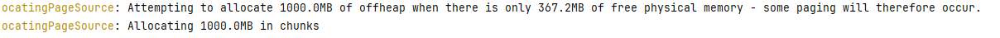

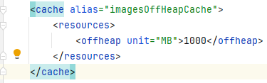

11)   Урок 13. JMH.
      В сервисе image-service есть три реализации кэширования для изображений:
      off-heap,
      concurrent map,
      soft-reference + ReadWriteLock.
      Написан сравнительный JMH тест для этих трех имплементаций.
      Класс: ru.amironnikov.image.ImageCachesBenchmark

      Получены следующие результаты тестов производительности:

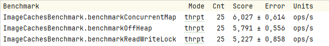

   Таким образом быстрее всего работает локальный кэш с ConcurrentHashMap.

12)   Урок 22. Реактивное программирование: Reactor.
      Сервис order-service реализован на Spring WebFlux с r2dbc драйвером Postgres.

13)   Урок 25. Вспоминаем Docker. У всех сервисов есть Dockerfile, готовы к запуску в Docker.
      Настроен docker-compose для запуска всей системы. 
     [docker-compose.yml](docker-compose.yml)

14)    Урок 18. Профилирование java приложений. Thread dump, JFR.

       Подадим нагрузку на сервис image-service, запросами на получение несуществующего изображения:

       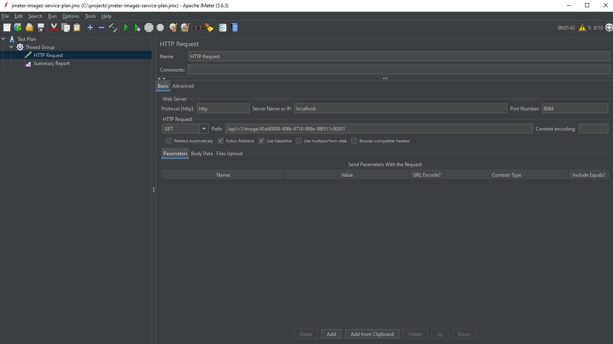


Запросим журнал JFR:

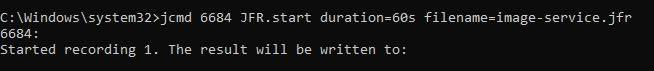

Откроем журнал в JMC:

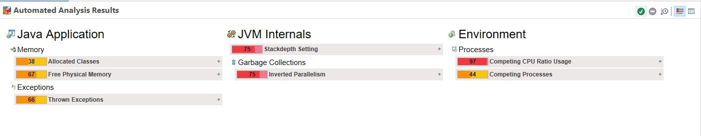

Самый популярный метод:

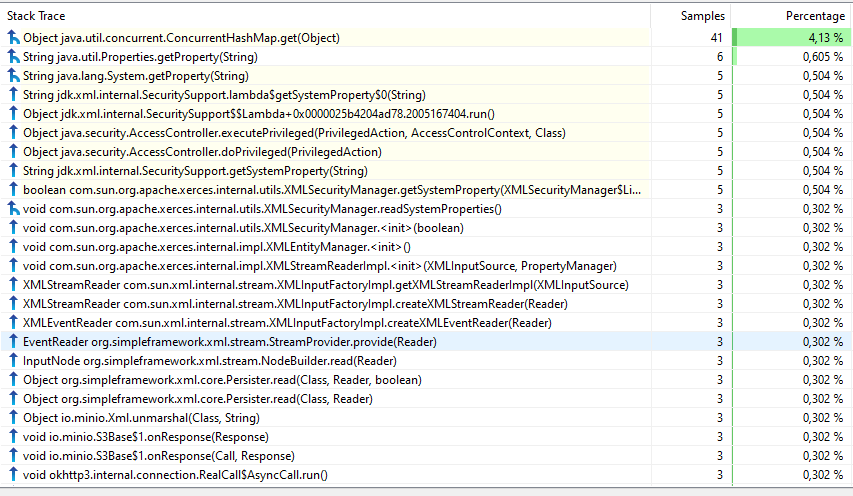

Очень большое количество исключений - единственная проблема:

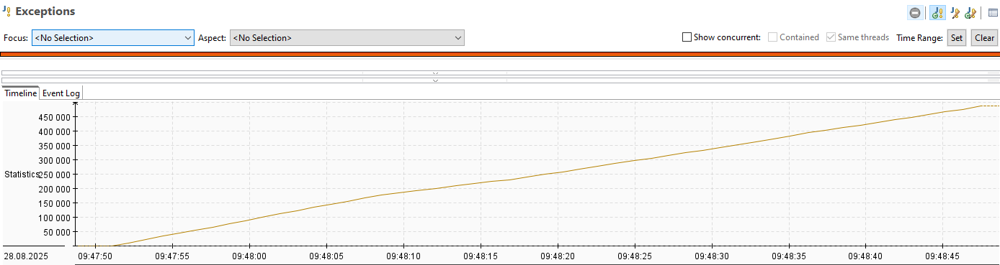

15) Урок 19. Профилирование java приложений. Работа с VisualVM.

Имитируем искусственную проблему в приложении, добавив в класс ImageConcurrentMapServiceImpl 
удержание lock в течение 5 секунд.
Подадим нагрузку на сервис: 
Подключимся к приложению через VisualVM и находим проблему во вкладке "Locks":

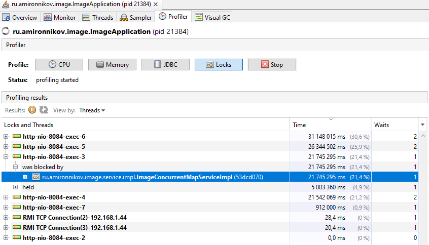

16) Урок 31. Проектирование и архитектура в разрезе микросервисов.

Были использованы следующие паттерны:
*     Database per service
*     Api Gateway
*     Service registry
*     Rate Limiter
*     Circuit Breaker
*     Health Check
   
17) Урок 28. Метрики.

Во всех сервисах подключен Actuator.
В order-service добавлен счетчик количества запросов на создание заказа "online_store_create_order_total.
Пример работы метрики:

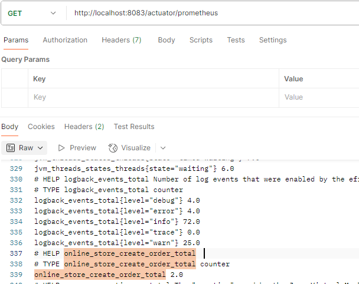

18) Урок 29. Prometheus & Grafana

Настроены Prometheus и Grafana, добавлены в docker-compose, к проекту прикреплен дашборд:
[mironnikov-dashboard.json](grafana%2Fdashboards%2Fmironnikov-dashboard.json)


19) Урок 37. Шаблоны проектирования отказоустойчивого сервиса. 
Rate Limiter и Circuit Breaker применены в order-service.
Класс ProductController.

20) Урок 38. Выполнение задач по расписанию в Java.
В сервисе order-service в классе LoggingScheduler реализован простой планировщик для логгирования состояния БД.


21) Урок 16. Java.util.concurrent. Locks, ReadWriteLock, ReentrantLock.
В сервисе image-service в классе ImageSoftReferenceServiceImpl используется ReadWriteLock.

22) Пункт ТЗ. Тесты с применением JMH.
    В сервисе image-service реализованы тесты разных реализаций кэша для изображений.
23) Пункт ТЗ. В приложениях должны быть кеши, для хранения справочных данных из БД.
    Работа с кешами подразумевает использование пакета java.util.concurrent.
    Кэши есть в image-service, order-service, dictionaries-service.
    Там же есть использование java.util.concurrent.
    Пример класса: OrderServiceImpl.

24) Kafka.
    Order-service и payment-service взаимодействуют через Kafka.

