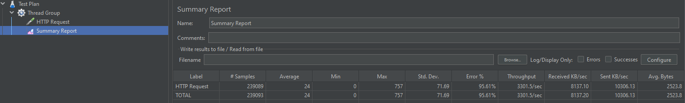
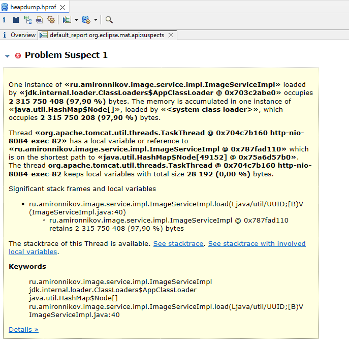
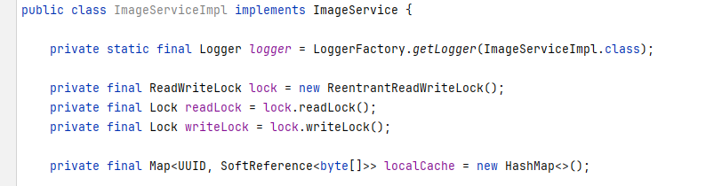
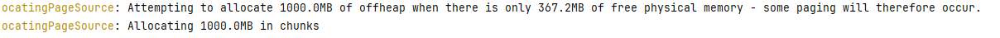
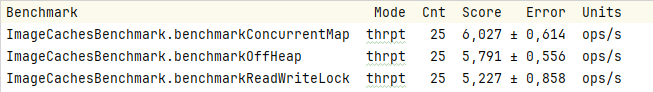

# online-store-microservice-architecture
Выпускной проект по курсу OTUS Java Developer Advanced

1) Java 11 vs 17 vs 21. везде используется Open JDK 21
2) Урок 15 ConcurrentHashMap в ProductServiceImpl
3) Урок 33 Swagger: http://localhost:8084/swagger-ui/index.html imageservice 
4) Урок 34 Protobuf and grpc: product service
5) Урок 4 Memory management. JVM memory structure: использование SoftReference в image-service: 
класс ru.amironnikov.image.service.impl.ImageSoftReferenceServiceImpl
6) 
7)
Урок 7 Memory Dump и Урок 14 Разбор JMeter и организация нагрузочного тестирования.
Подадим нагрузку на сервис изображений с помощью JMeter

Подождём пару минут и соберем дамп памяти командой 
   ```bash
      jmap -dump:format=b,file=heapdump.hprof,live <pid>
   ```
Загрузим дамп в Eclipse Memory Analyzer:



В отчёте видно, что больше всего памяти потребляет HashMap в классе ImageServiceImpl.
Как и ожидалось, т.к. там находится кэш изображений:



9) Для миграций использовался Liquibase - пункт 3 требований (Word файл "тз по проектной работе")
10) Каждое приложение работает со своей схемой данных, в которых есть справочники 
(Word файл "тз по проектной работе")- пункт 2 требований (Word файл "тз по проектной работе")
11) В сервисе image-service используется off-heap cache в классе
ru.amironnikov.image.service.impl.ImageOffHeapServiceImpl





Это Урок 8 "Off-heap"

12) Урок 13 JMH.
В сервисе image-service есть три реализации кэширования для изображений:
off-heap, concurrent map, soft-reference + ReadWriteLock (Урок 16).
Написан сравнительный JMH тест для этих трех имплементаций.
Класс: ru.amironnikov.image.ImageCachesBenchmark

Получены следующие результаты тестов производительности:



Таким образом быстрее всего работает локальный кэш с ConcurrentHashMap.


13) Урок 22. Реактивное программирование: Reactor.
Сервис order-service реализован на Spring WebFlux с r2dbc драйвером Postgres.

14) Урок 25. У всех сервисов есть Dockerfile, готовы к запуску в Docker.

Урок 9 GraalVM - попробовать добавить в другие модули ????
Урок 21 Java NIO - работу с файлами добавить
Урок 18 - профилирование
УРок 19 - профилирование